# Google Calendar ↔ Linear Sync Architecture

This document visualizes the bidirectional sync system architecture using the **Declarative Reconciliation Loop (DRL)** pattern.

## Main Sync Flow

```mermaid
sequenceDiagram
    participant User
    participant Worker as SyncWorker
    participant Linear as Linear API
    participant GCal as Google Calendar API
    participant Projector
    participant Diff as Diff Engine
    participant Actuator

    User->>Worker: deno task sync
    
    Note over Worker: 1. OBSERVE Phase
    Worker->>Linear: getIssues(teamId)
    Linear-->>Worker: LinearIssue[]
    Worker->>GCal: getEvents(calendarId, timeRange)
    GCal-->>Worker: GCalEvent[]
    
    Note over Worker: 2. PROJECT Phase
    Worker->>Projector: project(linearIssues, gcalEvents)
    Projector->>Projector: Parse metadata links
    Projector->>Projector: Classify into phases
    Projector-->>Worker: CanonicalItem[]
    
    Note over Worker: 3. DIFF Phase
    Worker->>Diff: diff(canonicalItems)
    Diff->>Diff: Analyze phase transitions
    Diff->>Diff: Generate operations
    Diff-->>Worker: Operation[]
    
    Note over Worker: 4. ACTUATE Phase
    Worker->>Actuator: execute(operations)
    
    loop For each operation
        alt Create Linear Issue
            Actuator->>Linear: createIssue()
            Linear-->>Actuator: LinearIssue
            Actuator->>GCal: updateEvent(addMetadata)
        else Create GCal Event
            Actuator->>GCal: createEvent()
            GCal-->>Actuator: GCalEvent
            Actuator->>Linear: updateIssue(addMetadata)
        else Update Status
            Actuator->>GCal: updateEvent(prefix)
        end
    end
    
    Actuator-->>Worker: SyncResult
    Worker-->>User: ✅ Sync completed
```

## Phase Transition Logic

```mermaid
stateDiagram-v2
    [*] --> eventOnly: New GCal event
    [*] --> linearOnly: New Linear issue
    
    eventOnly --> active: Create Linear issue (📥 Triage)
    linearOnly --> active: Create GCal event (📅 Scheduled)
    
    active --> completed: Linear state = Done/Canceled/Failed
    active --> overdue: >24h past event end
    active --> active: Metadata sync
    
    completed --> [*]: Update GCal prefix (✅/🚫/❌)
    overdue --> [*]: Archive with ⏳ prefix
    
    note right of eventOnly
        📥 GCal event without
        Linear match
    end note
    
    note right of linearOnly
        📅 Linear issue marked
        as "Scheduled"
    end note
    
    note right of active
        🔄 Both systems have
        linked records
    end note
    
    note right of completed
        ✅ Linear marked as
        Done/Canceled/Failed
    end note
    
    note right of overdue
        ⏳ Past deadline but
        still tracking
    end note
```

## Data Flow Architecture

```mermaid
flowchart TD
    A[Linear Issues] --> P[Projector]
    B[Google Calendar Events] --> P
    
    P --> C1[eventOnly Items]
    P --> C2[linearOnly Items] 
    P --> C3[active Items]
    P --> C4[completed Items]
    P --> C5[overdue Items]
    
    C1 --> D[Diff Engine]
    C2 --> D
    C3 --> D
    C4 --> D
    C5 --> D
    
    D --> O1[createLinearIssue]
    D --> O2[createGCalEvent]
    D --> O3[patchGCalEvent]
    D --> O4[createRescheduledEvent]
    
    O1 --> Act[Actuator]
    O2 --> Act
    O3 --> Act
    O4 --> Act
    
    Act --> LA[Linear API]
    Act --> GA[Google Calendar API]
    
    LA --> LU[📥 Issues Created/Updated]
    GA --> GU[📅 Events Created/Updated]
    
    style P fill:#e1f5fe
    style D fill:#f3e5f5
    style Act fill:#e8f5e8
    style LA fill:#fff3e0
    style GA fill:#fce4ec
```

## Metadata Linking System

## Development Workflow

## Key Design Principles

- **Stateless**: No database required; all state lives in remote systems via UID linkages
- **Deterministic**: Pure functions ensure identical inputs always produce identical outputs  
- **Idempotent**: Operations can be safely retried without side effects
- **Minimal**: Only necessary changes are made to external systems
- **Observable**: Clear phase classifications and operation logging for debugging